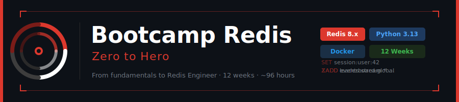

<p align="center">
  
</p>

<p align="center">
  <a href="#"></a>
  <a href="#"></a>
  <a href="#"></a>
  <a href="#"></a>
  <a href="#"></a>
</p>

<p align="center">
  <a href="README_EN.md"></a>
</p>

---

## � Descripción

Bootcamp de **12 semanas (~96 horas)** para llevar a estudiantes de cero a héroe en el
dominio de Redis como base de datos en memoria, motor de caching, broker de mensajes y
plataforma de procesamiento de datos en tiempo real.

**Nivel de salida:** Redis Engineer Junior/Mid

---

## 🗺️ Plan de Estudios

### Fundamentos (Semanas 1–4) — 32 horas

| Semana                                                 | Tema                                          | Estado       |
| ------------------------------------------------------ | --------------------------------------------- | ------------ |
| [01](bootcamp/week-01-intro_redis_y_strings/README.md) | Introducción a Redis, redis-cli y Strings     | ✅ Completo  |
| [02](bootcamp/week-02-listas/README.md)                | Listas                                        | 🔲 Pendiente |
| [03](bootcamp/week-03-sets/README.md)                  | Sets                                          | 🔲 Pendiente |
| [04](bootcamp/week-04-hashes_y_sorted_sets/README.md)  | Hashes, Sorted Sets, Persistencia y Seguridad | 🔲 Pendiente |

### Estructuras Avanzadas y Patrones (Semanas 5–8) — 32 horas

| Semana                                                     | Tema                          | Estado       |
| ---------------------------------------------------------- | ----------------------------- | ------------ |
| [05](bootcamp/week-05-pubsub/README.md)                    | Pub/Sub                       | 🔲 Pendiente |
| [06](bootcamp/week-06-streams/README.md)                   | Redis Streams                 | 🔲 Pendiente |
| [07](bootcamp/week-07-transacciones_y_scripting/README.md) | Transacciones y Scripting Lua | 🔲 Pendiente |
| [08](bootcamp/week-08-pipelining_y_benchmarking/README.md) | Pipelining y Benchmarking     | 🔲 Pendiente |

### Integración con Python (Semanas 9–10) — 16 horas

| Semana                                              | Tema                                              | Estado       |
| --------------------------------------------------- | ------------------------------------------------- | ------------ |
| [09](bootcamp/week-09-redis_py_sincrono/README.md)  | redis-py Síncrono — Patrones de Aplicación        | 🔲 Pendiente |
| [10](bootcamp/week-10-redis_py_asincrono/README.md) | redis-py Asíncrono — Locks, Queues y Leaderboards | 🔲 Pendiente |

### Alta Disponibilidad y Producción (Semanas 11–12) — 16 horas

| Semana                                                       | Tema                                                  | Estado       |
| ------------------------------------------------------------ | ----------------------------------------------------- | ------------ |
| [11](bootcamp/week-11-alta_disponibilidad/README.md)         | Alta Disponibilidad — Replicación, Sentinel y Cluster | 🔲 Pendiente |
| [12](bootcamp/week-12-produccion_y_proyecto_final/README.md) | Producción y Proyecto Final Integrador                | 🔲 Pendiente |

---

## 🚀 Inicio Rápido

```bash
# 1. Clonar el repositorio
git clone https://github.com/ergrato-dev/bc-redis.git
cd bc-redis

# 2. Leer el setup
cat docs/setup/README.md

# 3. Ir a la primera semana
cd bootcamp/week-01-intro_redis_y_strings
docker compose up -d
```

---

## 🛠️ Stack Tecnológico

| Herramienta    | Versión | Propósito                         |
| -------------- | ------- | --------------------------------- |
| Redis          | 8.x     | Motor de base de datos en memoria |
| redis-py       | 5.2.1   | Cliente Python (sync y async)     |
| Python         | 3.13    | Lenguaje de integración           |
| fakeredis      | 2.35.1  | Redis en memoria para testing     |
| pytest         | 8.3.5   | Testing                           |
| pytest-asyncio | 0.24.0  | Testing async                     |
| Docker         | 27.5+   | Containerización                  |
| Docker Compose | 2.32+   | Orquestación                      |
| RedisInsight   | 2.58    | GUI para exploración y monitoreo  |

---

## 📁 Estructura del Repositorio

```
bc-redis/
├── README.md                      ← Este archivo
├── assets/                        ← Recursos visuales globales
├── docs/
│   └── setup/                     ← Guías de instalación (Docker, local, Fedora)
├── bootcamp/
│   ├── week-01-intro_redis_y_strings/   ← ✅ Completo
│   ├── week-02-listas/
│   ├── week-03-sets/
│   ├── week-04-hashes_y_sorted_sets/
│   ├── week-05-pubsub/
│   ├── week-06-streams/
│   ├── week-07-transacciones_y_scripting/
│   ├── week-08-pipelining_y_benchmarking/
│   ├── week-09-redis_py_sincrono/
│   ├── week-10-redis_py_asincrono/
│   ├── week-11-alta_disponibilidad/
│   └── week-12-produccion_y_proyecto_final/
└── .github/
    ├── copilot-instructions.md
    ├── instructions/              ← Reglas automáticas para Copilot
    └── prompts/                   ← Prompts de agente reutilizables
```

---

## 📚 Documentación

- [Setup con Docker](docs/setup/docker.md)
- [Setup local (Ubuntu / Fedora / macOS)](docs/setup/local.md)
- [Copilot Instructions](.github/copilot-instructions.md)

---

## 🤝 Contribuciones

Este repositorio sigue el flujo de trabajo del bootcamp. Para reportar errores o proponer
mejoras, abrir un issue en [GitHub](https://github.com/ergrato-dev/bc-redis/issues).

---

_Redis Zero to Hero — ergrato.dev · Abril 2026_
