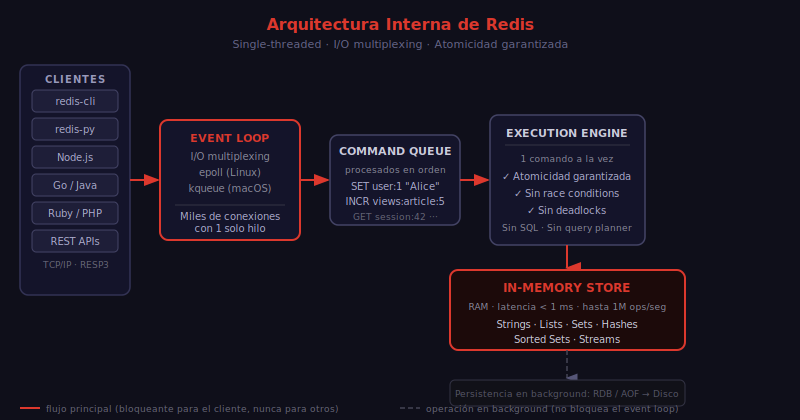

# ¿Qué es Redis?

## 🎯 Objetivos

- Entender qué es Redis y por qué existe
- Conocer sus características fundamentales
- Identificar cuándo usar Redis (y cuándo no)
- Comprender cómo se diferencia de otras bases de datos

---

## 📋 Contenido

### 1. Definición

**Redis** (REmote DIctionary Server) es una base de datos en memoria de código abierto que almacena datos como pares clave-valor. Fue creada por Salvatore Sanfilippo en 2009 y actualmente es mantenida por Redis Ltd.

Lo que hace especial a Redis es que no solo almacena strings: soporta estructuras de datos nativas como listas, sets, sorted sets, hashes y streams. Cada estructura tiene comandos propios optimizados para operaciones específicas.

### 2. Características Fundamentales

#### In-memory

Redis almacena todos los datos en RAM. Esto lo hace extremadamente rápido:

- Latencia de operaciones: **< 1 milisegundo**
- Throughput: **hasta 1 millón de operaciones/segundo** en hardware estándar

El precio: la memoria RAM es limitada y volátil. Redis ofrece mecanismos de persistencia (RDB y AOF) para sobrevivir reinicios.

#### Single-threaded

El motor de comandos de Redis es de un solo hilo. Esto puede parecer una limitación, pero tiene una ventaja enorme:

> **Todas las operaciones en Redis son atómicas por diseño.**

No hay condiciones de carrera. Un `INCR` siempre incrementa y retorna en una sola operación, sin que otro cliente interfiera en medio.

#### Estructuras de Datos Nativas

A diferencia de Memcached (solo strings), Redis entiende el tipo de dato que almacena:

| Estructura | Caso de Uso |
| ---------- | ----------- |
| String | Cache, contadores, flags, sesiones |
| List | Queues, historiales, feeds |
| Set | Tags, relaciones únicas, intersecciones |
| Sorted Set | Leaderboards, rangos, rate limiting |
| Hash | Objetos, perfiles de usuario |
| Stream | Event log, mensajería, IoT |

### 3. Redis vs Otras Bases de Datos

#### Redis vs PostgreSQL / MySQL

| Aspecto | Redis | PostgreSQL |
| ------- | ----- | ---------- |
| Almacenamiento | RAM | Disco |
| Latencia | < 1 ms | 1–100 ms |
| Persistencia | Opcional | Siempre |
| Relaciones | No | Sí (JOIN) |
| Consultas complejas | No (sin SQL) | Sí |
| Capacidad | GB (limitada por RAM) | TB |
| Uso principal | Cache, tiempo real | Fuente de verdad |

**Conclusión**: Redis no reemplaza a PostgreSQL. Los usa juntos: PostgreSQL como fuente de verdad, Redis como capa de acceso rápido.

#### Redis vs Memcached

| Aspecto | Redis | Memcached |
| ------- | ----- | --------- |
| Estructuras | Múltiples | Solo strings |
| Persistencia | Sí (RDB/AOF) | No |
| Replicación | Sí | No |
| Pub/Sub | Sí | No |
| Lua scripting | Sí | No |
| Cluster | Sí (nativo) | Limitado |

**Conclusión**: Elige Redis. Memcached es más simple pero Redis tiene toda su funcionalidad más un ecosistema mucho más rico.

### 4. Cuándo Usar Redis

#### ✅ Redis es la elección correcta para:

- **Cache de consultas costosas**: resultados de queries SQL, respuestas de APIs externas
- **Session store**: sesiones de usuario con TTL automático
- **Contadores en tiempo real**: vistas, likes, requests por segundo
- **Rate limiting**: limitar llamadas de API por usuario
- **Leaderboards**: rankings de videojuegos, puntuaciones
- **Pub/Sub y mensajería**: notificaciones en tiempo real
- **Job queues**: colas de tareas en background
- **Distributed locks**: coordinación entre instancias de microservicios

#### ❌ Redis NO es la elección correcta para:

- Datos que deben sobrevivir a pérdida de RAM sin alternativa
- Consultas complejas con joins y agregaciones
- Datos que exceden la memoria disponible
- Fuente de verdad única (sin base de datos complementaria)

### 5. Redis en el Mundo Real

Empresas que usan Redis en producción:

- **Twitter/X**: timeline de usuarios, contadores de tweets
- **GitHub**: gestión de sessions, rate limiting de API
- **Stack Overflow**: cache de preguntas y respuestas populares
- **Airbnb**: disponibilidad de propiedades en tiempo real
- **Uber**: geolocalización y matching de conductores

---

### 6. Historia y Versiones Clave

Redis tiene una evolución rápida y constante. Conocer los hitos principales ayuda a entender por qué ciertos patrones existen y cuándo aparecieron:

| Versión | Año | Hito Principal |
| ------- | --- | -------------- |
| 1.0 | 2010 | Estructuras de datos básicas (Strings, Lists, Sets) |
| 2.0 | 2011 | Sorted Sets, Hashes, Pub/Sub |
| 2.6 | 2012 | Scripting Lua con EVAL |
| 2.8 | 2013 | Sentinel (alta disponibilidad), Keyspace Notifications |
| 3.0 | 2015 | Redis Cluster (sharding nativo) |
| 4.0 | 2017 | Módulos, lazy deletion, OBJECT FREQ |
| 5.0 | 2018 | Redis Streams (estructura nueva) |
| 6.0 | 2020 | ACLs (control de acceso), TLS nativo, RESP3 |
| 6.2 | 2021 | LMPOP, ZRANDMEMBER, OBJECT HELP |
| 7.0 | 2022 | Redis Functions (reemplaza EVALSHA), Multi-Part AOF |
| 7.2 | 2023 | SINTERCARD, mejoras en Streams y Cluster |
| 8.0 | 2025 | Redis abierto bajo AGPL, mejoras de rendimiento |

> En este bootcamp usamos **Redis 8.x**, la versión más reciente.

### 7. Arquitectura Interna Simplificada

Entender cómo funciona Redis internamente ayuda a predecir su comportamiento:



```
Cliente 1 ──┐
Cliente 2 ──┤──→ Event Loop (I/O multiplexing) ──→ Command Queue ──→ Execution Engine
Cliente 3 ──┘                                                            │
                                                                         ▼
                                                                    In-Memory Store
                                                                    (RAM)
                                                                         │
                                                                         ▼
                                                               Persistence Layer
                                                               (RDB / AOF → Disco)
```

**Puntos clave:**

1. **I/O multiplexing**: Redis acepta miles de conexiones concurrentes con un solo hilo usando `epoll` (Linux) o `kqueue` (macOS). Las conexiones esperan sin bloquear.
2. **Command Queue**: los comandos se encolan y se procesan uno a uno. Esto garantiza atomicidad.
3. **Execution Engine**: ejecuta cada comando directamente en estructuras de datos en RAM. Sin parsing SQL, sin query planner.
4. **Persistence Layer**: opcionalmente serializa el estado a disco en background (sin bloquear el event loop principal).

### 8. Redis vs la Pirámide de Almacenamiento

Redis se ubica en la capa más rápida accesible por red:

```
Velocidad (más rápido arriba)
         ▲
         │  CPU Registers  (< 1 ns)
         │  L1/L2/L3 Cache (1-30 ns)
         │  RAM local      (50-100 ns)
         │  Redis          (< 1 ms — acceso por red)   ← estamos aquí
         │  SSD NVMe       (0.1 ms local, más por red)
         │  PostgreSQL/MySQL (1-100 ms)
         │  HDD             (10 ms)
         ▼
Capacidad (más capacidad abajo)
```

Redis es la capa de almacenamiento más rápida que puede compartirse entre múltiples servidores o procesos. Por eso es ideal para:
- Datos que se leen frecuentemente y cambian poco (cache)
- Operaciones que deben ser atómicas entre procesos distribuidos (locks, contadores)
- Comunicación en tiempo real entre servicios (Pub/Sub, Streams)

---

## 📚 Recursos Adicionales

- [Redis Introduction — Documentación oficial](https://redis.io/docs/latest/get-started/)
- [Redis Data Types — Overview](https://redis.io/docs/latest/develop/data-types/)
- [Redis History — Wikipedia](https://en.wikipedia.org/wiki/Redis)
- [antirez blog — Why Redis is single-threaded](http://antirez.com/news/96)

---

## ✅ Checklist de Verificación

Antes de continuar con el siguiente tema, verifica que puedes responder:

- [ ] ¿Qué significa "in-memory" y qué trade-off implica?
- [ ] ¿Por qué el modelo single-threaded garantiza atomicidad?
- [ ] ¿Cuál es la diferencia entre Redis y Memcached?
- [ ] ¿En qué casos NO usarías Redis?
- [ ] ¿Para qué usaría Redis Twitter o GitHub?
- [ ] ¿En qué versión de Redis aparecieron los Streams?
- [ ] ¿Qué es I/O multiplexing y por qué permite manejar miles de conexiones con un hilo?
