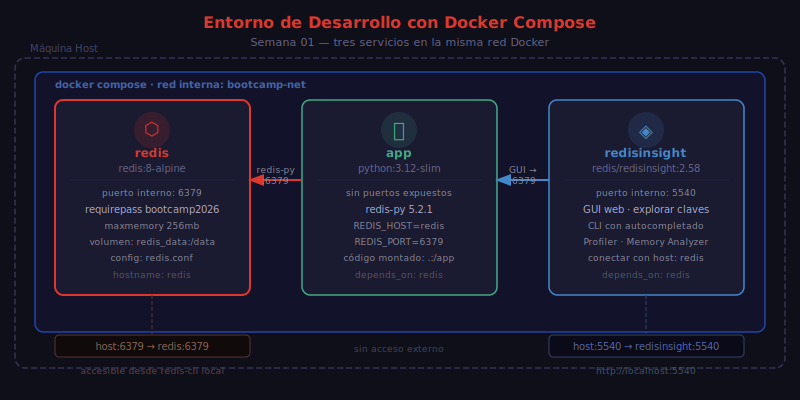

# Instalación con Docker

## 🎯 Objetivos

- Levantar Redis 8 con Docker Compose
- Configurar Redis con un archivo `redis.conf` básico
- Acceder a RedisInsight para exploración visual
- Conectarse a redis-cli dentro del contenedor

---

## 📋 Contenido

### 1. ¿Por qué Docker?

En este bootcamp **nunca instalaremos Redis directamente en el sistema operativo**. Docker nos da:

- Entorno idéntico para todos los estudiantes
- Redis 8 sin conflictos con otras versiones
- Limpieza total con `docker compose down -v`
- RedisInsight integrado sin instalación adicional

### 2. Estructura del Proyecto

Crea la siguiente estructura para levantar el entorno:

```
entorno-redis/
├── docker-compose.yml
├── redis.conf
└── .env
```

### 3. Archivo `docker-compose.yml`



```yaml
services:
  redis:
    image: redis:8-alpine
    container_name: redis-bootcamp
    ports:
      - "${REDIS_PORT:-6379}:6379"
    volumes:
      - redis_data:/data
      - ./redis.conf:/usr/local/etc/redis/redis.conf
    command: redis-server /usr/local/etc/redis/redis.conf
    restart: unless-stopped

  redisinsight:
    image: redis/redisinsight:2.58
    container_name: redisinsight-bootcamp
    ports:
      - "5540:5540"
    depends_on:
      - redis
    restart: unless-stopped

volumes:
  redis_data:
```

### 4. Archivo `redis.conf`

Configuración mínima segura para desarrollo:

```conf
# Networking
bind 0.0.0.0
port 6379
protected-mode no

# Authentication (cambia esta contraseña)
requirepass bootcamp2026

# Memory
maxmemory 256mb
maxmemory-policy allkeys-lru

# Persistence (RDB snapshot)
save 900 1
save 300 10
save 60 10000
dbfilename dump.rdb
dir /data

# Logging
loglevel notice
logfile ""

# Slow log (comandos > 10ms)
slowlog-log-slower-than 10000
slowlog-max-len 128
```

> ⚠️ `protected-mode no` solo es seguro dentro de Docker con red interna. **Nunca en producción sin autenticación y bind restringido.**

### 5. Archivo `.env`

```env
REDIS_PORT=6379
REDIS_PASSWORD=bootcamp2026
```

### 6. Levantar el Entorno

```bash
# Levantar Redis + RedisInsight en background
docker compose up -d

# Verificar que ambos contenedores están corriendo
docker compose ps

# Ver logs de Redis
docker compose logs -f redis
```

Salida esperada de `docker compose ps`:

```
NAME                    IMAGE                    STATUS
redis-bootcamp          redis:8-alpine           Up
redisinsight-bootcamp   redis/redisinsight:2.58  Up
```

### 7. Conectarse a redis-cli

```bash
# Opción 1: redis-cli dentro del contenedor (recomendado)
docker compose exec redis redis-cli -a bootcamp2026

# Opción 2: con autenticación inline
docker compose exec redis redis-cli -a bootcamp2026 PING
# → PONG

# Opción 3: autenticar dentro de redis-cli
docker compose exec redis redis-cli
127.0.0.1:6379> AUTH bootcamp2026
# → OK
127.0.0.1:6379> PING
# → PONG
```

> 💡 Redis 8 muestra `Warning: Using a password with '-a' or '-u' option on the command line interface may not be safe.` — es solo un aviso educativo, no un error.

### 8. RedisInsight

Abre el navegador en [http://localhost:5540](http://localhost:5540).

Para conectar a Redis desde RedisInsight:
- **Host**: `redis` (nombre del servicio en Docker)
- **Port**: `6379`
- **Password**: `bootcamp2026`

RedisInsight te permite:
- Explorar claves con filtros
- Ver el contenido de cada estructura de datos
- Ejecutar comandos con autocompletado
- Monitorear métricas en tiempo real

### 9. Detener el Entorno

```bash
# Solo detener (mantiene los datos en volumen)
docker compose down

# Detener Y eliminar todos los datos
docker compose down -v
```

---

## 📚 Recursos Adicionales

- [Redis Docker Hub — redis:8-alpine](https://hub.docker.com/_/redis)
- [RedisInsight Documentation](https://redis.io/insight/)
- [redis.conf Reference](https://redis.io/docs/latest/operate/oss_and_stack/management/config/)

---

## ✅ Checklist de Verificación

- [ ] `docker compose up -d` levanta sin errores
- [ ] `docker compose ps` muestra ambos contenedores como `Up`
- [ ] `redis-cli PING` retorna `PONG`
- [ ] RedisInsight accesible en http://localhost:5540
- [ ] AUTH con contraseña funciona correctamente
