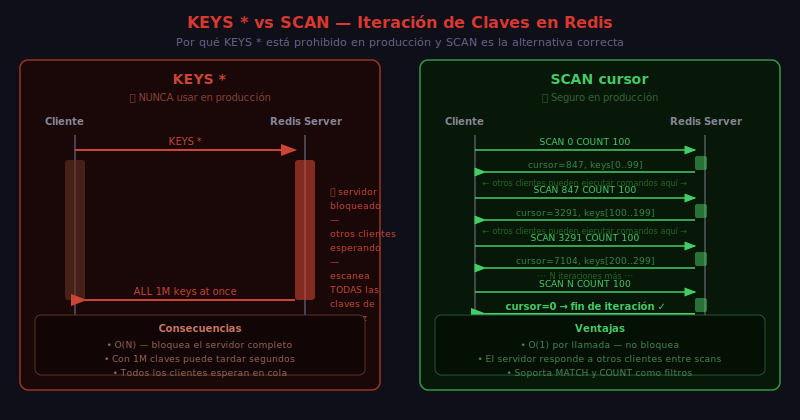

# redis-cli

## 🎯 Objetivos

- Conectarse a Redis con redis-cli
- Navegar entre bases de datos
- Inspeccionar claves: tipo, TTL, codificación
- Iterar claves de forma segura con SCAN
- Obtener información del servidor con INFO

---

## 📋 Contenido

### 1. Conexión

```bash
# Conexión básica (local, sin autenticación)
redis-cli

# Con autenticación
redis-cli -a tu_password

# A host y puerto específicos
redis-cli -h 127.0.0.1 -p 6379 -a tu_password

# Dentro de Docker (forma recomendada en este bootcamp)
docker compose exec redis redis-cli -a bootcamp2026
```

Una vez conectado, el prompt cambia a:
```
127.0.0.1:6379>
```

### 2. Comandos de Conexión y Diagnóstico

```bash
# Verificar que Redis responde
PING
# → PONG

# Mensaje personalizado
PING "hola redis"
# → "hola redis"

# Cerrar conexión
QUIT
```

### 3. Navegación de Bases de Datos

Redis soporta 16 bases de datos numeradas del 0 al 15. La base de datos por defecto es la 0.

```bash
# Ver en qué base de datos estamos (aparece en el prompt: 127.0.0.1:6379[2]>)
# Seleccionar base de datos 1
SELECT 1
# → OK

# Contar claves en la base de datos actual
DBSIZE
# → (integer) 0

# Volver a la base de datos 0
SELECT 0
# → OK
```

> ⚠️ En Redis Cluster, solo existe la base de datos 0. Usa namespacing con prefijos en lugar de múltiples DBs.

### 4. Comandos de Claves (Key Commands)

Estos comandos operan sobre cualquier tipo de clave:

```bash
# Verificar si una clave existe
EXISTS user:42
# → (integer) 1  (existe)
# → (integer) 0  (no existe)

# Ver el tipo de una clave
TYPE user:42
# → string

TYPE leaderboard:global
# → zset

# Ver TTL de una clave (en segundos)
TTL session:user:42
# → (integer) 3540  (segundos restantes)
# → (integer) -1    (sin expiración)
# → (integer) -2    (clave no existe)

# TTL en milisegundos
PTTL session:user:42
# → (integer) 3540000

# Establecer expiración en segundos
EXPIRE session:user:42 3600
# → (integer) 1

# Establecer expiración en milisegundos
PEXPIRE session:user:42 3600000
# → (integer) 1

# Eliminar la expiración (hacer persistente)
PERSIST session:user:42
# → (integer) 1

# Eliminar una clave
DEL user:42
# → (integer) 1  (número de claves eliminadas)

# Renombrar una clave
RENAME old:key new:key
# → OK

# Mover clave a otra base de datos
MOVE user:42 1
# → (integer) 1
```

### 5. Inspección Interna

```bash
# Codificación interna que usa Redis para almacenar la clave
OBJECT ENCODING user:42
# → "embstr"   (string corto ≤ 44 bytes)
# → "raw"      (string largo > 44 bytes)
# → "int"      (número entero)

# Tiempo desde el último acceso (en segundos)
OBJECT IDLETIME user:42
# → (integer) 120

# Frecuencia de acceso (con política LFU)
OBJECT FREQ user:42
# → (integer) 5
```

### 6. Iteración Segura de Claves



#### ❌ NUNCA usar KEYS * en producción

```bash
# ❌ PELIGROSO - bloquea Redis hasta terminar
KEYS *
KEYS user:*
```

`KEYS` itera TODAS las claves del servidor en una sola operación bloqueante. Con millones de claves, puede congelar Redis varios segundos.

#### ✅ Usar SCAN siempre

```bash
# SCAN cursor [MATCH pattern] [COUNT count] [TYPE type]
# El cursor inicial es siempre 0
SCAN 0
# → 1) "14"            ← cursor para la siguiente iteración
# → 2) 1) "user:10"   ← claves devueltas en esta iteración
#       2) "user:42"

# Continuar desde el cursor retornado
SCAN 14
# → 1) "0"             ← cursor = 0 significa que terminamos
# → 2) 1) "session:5"

# SCAN con filtro de patrón
SCAN 0 MATCH "user:*" COUNT 100
# → 1) "7"
# → 2) 1) "user:1"
#       2) "user:42"

# SCAN solo claves de tipo string
SCAN 0 TYPE string
```

> COUNT es una **sugerencia** al servidor, no una garantía. Redis puede devolver más o menos claves.

### 7. Información del Servidor

```bash
# Información completa del servidor
INFO

# Sección específica
INFO server        # versión, OS, uptime
INFO clients       # conexiones activas
INFO memory        # uso de memoria RAM
INFO stats         # operaciones por segundo
INFO replication   # estado de replicación
INFO keyspace      # claves por base de datos
```

Ejemplo de salida de `INFO server`:

```
redis_version:8.0.0
redis_mode:standalone
os:Linux 5.15.0 x86_64
uptime_in_seconds:3600
uptime_in_days:0
connected_clients:3
used_memory_human:2.50M
total_commands_processed:15234
```

### 8. Limpieza (solo en desarrollo)

```bash
# Eliminar TODAS las claves de la base de datos actual
FLUSHDB

# Eliminar TODAS las claves de TODAS las bases de datos
FLUSHALL

# Versión asíncrona (no bloquea)
FLUSHDB ASYNC
FLUSHALL ASYNC
```

> ⚠️ Estos comandos son **irreversibles**. Nunca ejecutarlos en producción. En este bootcamp, está configurado en `redis.conf` con `rename-command FLUSHALL ""` para entornos productivos.

---

## 📚 Recursos Adicionales

- [SCAN — Documentación oficial](https://redis.io/commands/scan/)
- [OBJECT — Documentación oficial](https://redis.io/commands/object/)
- [redis-cli — Reference](https://redis.io/docs/latest/develop/connect/cli/)

---

## ✅ Checklist de Verificación

- [ ] Puedo conectarme con y sin `-a password`
- [ ] Sé navegar entre SELECT 0–15
- [ ] Uso SCAN en lugar de KEYS
- [ ] Conozco la diferencia entre TTL -1 y TTL -2
- [ ] Sé qué significa OBJECT ENCODING "embstr" vs "int"
- [ ] Puedo usar INFO para diagnosticar el estado del servidor
