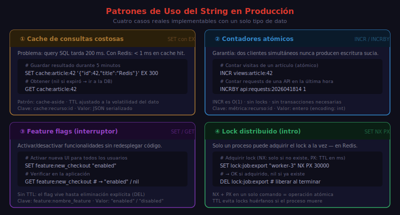

# Strings

## 🎯 Objetivos

- Dominar los comandos SET y GET con todas sus opciones
- Usar MSET/MGET para operaciones en batch
- Implementar contadores atómicos con INCR/DECR
- Controlar expiración con TTL
- Conocer los patrones de uso más comunes en producción

---

## 📋 Contenido

### 1. La Estructura String

String es la estructura más básica de Redis. Una clave String puede almacenar:

- Texto plano: `"Alice"`
- Números: `42`, `3.14`
- JSON serializado: `'{"id":1,"name":"Alice"}'`
- Binarios: imágenes, archivos (hasta 512 MB por clave)

La complejidad de todos los comandos String es **O(1)** a menos que se indique lo contrario.

### 2. SET y GET

```bash
# SET key value
SET user:42:name "Alice"
# → OK

# GET key
GET user:42:name
# → "Alice"

# GET de clave inexistente retorna nil
GET user:999:name
# → (nil)
```

#### Opciones de SET

```bash
# EX — expiración en segundos
SET session:user:42 "active" EX 3600
# → OK

# PX — expiración en milisegundos
SET rate:limit:ip:192.0.2.1 0 PX 60000
# → OK

# NX — solo crear si NO existe (set if not exists)
SET lock:resource:1 "worker-01" NX EX 30
# → OK       (si la clave no existía)
# → (nil)    (si la clave ya existía — NO se sobrescribe)

# XX — solo actualizar si YA existe (set if exists)
SET user:42:name "Bob" XX
# → OK    (si user:42:name existía)
# → (nil) (si no existía)

# GET — retorna el valor anterior al set (Redis 6.2+)
SET user:42:name "Carol" GET
# → "Bob"   (devuelve el valor anterior)

# KEEPTTL — mantiene el TTL existente al actualizar el valor
SET session:user:42 "updated" KEEPTTL
# → OK
```

### 3. GETSET y variantes

```bash
# GETDEL — obtiene y elimina en una operación atómica
GETDEL temp:token:abc123
# → "eyJhbGciOiJIUzI1NiJ9..."  (o nil si no existía)

# GETEX — obtiene y modifica la expiración
GETEX session:user:42 EX 7200
# → "active"   (y resetea TTL a 7200 segundos)

# GETEX sin opciones — igual a GET
GETEX user:42:name
# → "Carol"
```

### 4. Operaciones en Batch

```bash
# MSET — set múltiple (O(N))
MSET user:1:name "Alice" user:2:name "Bob" user:3:name "Carol"
# → OK

# MGET — get múltiple (O(N)) — retorna nil para claves inexistentes
MGET user:1:name user:2:name user:99:name
# → 1) "Alice"
# → 2) "Bob"
# → 3) (nil)

# MSETNX — set múltiple solo si NINGUNA existe (todo o nada)
MSETNX config:debug "false" config:env "development"
# → (integer) 1  (se crearon todas)
# → (integer) 0  (ninguna se creó porque alguna ya existía)
```

### 5. Contadores Atómicos

Los contadores son uno de los usos más frecuentes de Redis. Son atómicos: dos clientes incrementando simultáneamente nunca generan una condición de carrera.

```bash
# INCR — incrementa en 1 (crea la clave con valor 0 si no existe)
INCR article:42:views
# → (integer) 1

INCR article:42:views
# → (integer) 2

# INCRBY — incrementa en N
INCRBY article:42:views 10
# → (integer) 12

# DECR — decrementa en 1
DECR article:42:views
# → (integer) 11

# DECRBY — decrementa en N
DECRBY article:42:views 5
# → (integer) 6

# INCRBYFLOAT — incremento decimal (O(1))
INCRBYFLOAT product:1:rating 0.5
# → "4.5"
```

> Redis INCR/DECR operan sobre la representación entera del string. Si el valor no es un entero válido, devuelve error: `ERR value is not an integer or out of range`.

### 6. Manipulación de Strings

```bash
# APPEND — concatenar al final (O(1))
SET greeting "Hello"
APPEND greeting ", World!"
# → (integer) 13   (longitud total)

GET greeting
# → "Hello, World!"

# STRLEN — longitud del string (O(1))
STRLEN greeting
# → (integer) 13

# GETRANGE — subcadena por índice (O(N) donde N = rango)
# Índices negativos = desde el final
GETRANGE greeting 0 4
# → "Hello"

GETRANGE greeting -6 -1
# → "orld!"

# SETRANGE — modificar substring (O(1) si no redimensiona)
SETRANGE greeting 7 "Redis"
# → (integer) 13

GET greeting
# → "Hello, Redis!"
```

### 7. Verificación y Expiración

```bash
# EXISTS — verifica si la clave existe
EXISTS user:42:name
# → (integer) 1

# Verificar múltiples claves a la vez
EXISTS user:42:name user:99:name
# → (integer) 1   (solo user:42:name existe)

# TTL / PTTL — tiempo de vida restante
SET temp:value "42" EX 120
TTL temp:value
# → (integer) 119

PTTL temp:value
# → (integer) 118942

# EXPIRE — añadir o renovar expiración
EXPIRE user:42:name 86400
# → (integer) 1

# EXPIREAT — expirar en timestamp Unix absoluto
EXPIREAT flash:sale:banner 1788844800
# → (integer) 1

# PERSIST — eliminar la expiración
PERSIST temp:value
# → (integer) 1

TTL temp:value
# → (integer) -1   (sin expiración)
```

### 8. Patrones de Uso en Producción



#### Cache de consultas costosas

```bash
# Almacenar resultado de query con TTL de 5 minutos
SET cache:products:list '{"items":[...],"total":150}' EX 300

# Verificar antes de consultar la DB
EXISTS cache:products:list
GET cache:products:list
```

#### Contador de vistas / métricas

```bash
# Incremento atómico sin condiciones de carrera
INCR metric:api:requests:2026-04-18
INCR metric:api:requests:2026-04-18
# → (integer) 2

# Con expiración automática (auto-clean)
SET metric:daily:logins 0 EX 86400
INCR metric:daily:logins
```

#### Flag de feature toggle

```bash
SET feature:dark_mode:enabled "1" 
GET feature:dark_mode:enabled
# → "1"  → true
# → (nil) → false (feature no existe = desactivado)
```

#### Distributed lock simple (SET NX EX)

```bash
# Intentar adquirir el lock
SET lock:payment:order:99 "worker-01" NX EX 30
# → OK    → lock adquirido
# → (nil) → otro worker tiene el lock

# Liberar el lock
DEL lock:payment:order:99
```

> El lock distribuido robusto (Redlock) se cubre en la semana 10.

---

## 📚 Recursos Adicionales

- [SET — Documentación oficial](https://redis.io/commands/set/)
- [INCR — Documentación oficial](https://redis.io/commands/incr/)
- [Redis Strings explained — Redis University](https://university.redis.io/)

---

## ✅ Checklist de Verificación

- [ ] Sé la diferencia entre `SET key value EX 60` y `SETEX key 60 value`
- [ ] Entiendo por qué INCR es seguro en entornos concurrentes
- [ ] Puedo implementar un cache-or-fetch pattern con EXISTS + GET + SET EX
- [ ] Sé qué retorna GET cuando la clave no existe (`nil`)
- [ ] Conozco la diferencia entre `SET NX` y `SET XX`
- [ ] Sé cuándo usar MSET/MGET en lugar de múltiples SET/GET
